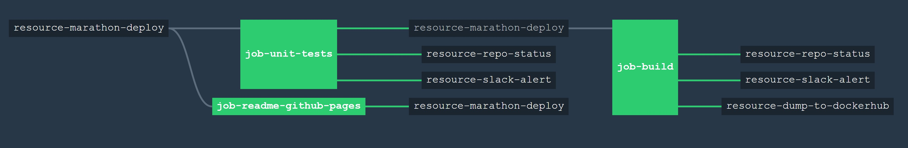

# resource-marathon-deploy

[](https://codeclimate.com/github/JeffDeCola/resource-marathon-deploy)
[](https://codeclimate.com/github/JeffDeCola/resource-marathon-deploy/issues)
[](https://goreportcard.com/report/jeffdecola/resource-marathon-deploy)
[](https://godoc.org/github.com/JeffDeCola/resource-marathon-deploy)
[](http://jeffdecola.mit-license.org)

_Written in GO, `resource-marathon-deploy` was used as a test to help develop [`marathon-resource`](https://github.com/ckaznocha/marathon-resource)._

`resource-marathon-deploy` is a Concourse resource type that deploys an APP to Marathon
using a .json file.

[GitHub Webpage](https://jeffdecola.github.io/resource-marathon-deploy/)

## DEVELOPED

This resource was built using [_`resource-template`_](https://github.com/JeffDeCola/resource-template).

## SOURCE CONFIGURATION

* `marathonuri`: The uri of marathon.

## BEHAVIOR

### CHECK (a resource version(s))

_CHECK will mimic getting the list of versions from a resource._

#### stdin

```json
{
  "source": {
    "source1": "sourcefoo1",
    "source2": "sourcefoo2"
  },
  "version": {
    "ref": "123 ",
  }
}
```

123 is the current version.

#### stdout

```json
[
  { "ref": "123" },
  { "ref": "3de" },
  { "ref": "456" }
]
```

456 is the latest version that will be used.

The last number 456 will become the current ref version that will be used by IN.

### IN (fetch a resource)

_IN will mimic fetching a resource and placing a file in the working directory._

#### Parameters

* `param1`: Just a placeholder.

* `param2`: Just a placeholder.

#### stdin

```json
{
  "source": {
    "source1": "sourcefoo1",
    "source2": "sourcefoo2"
  },
  "params": {
    "param1": "Hello Clif",
    "param2": "Nice to meet you"
  },
  "version": {
    "ref": "456",
  }
```

#### stdout

```json
{
  "version":{ "ref": "456" },
  "metadata": [
    { "name": "nameofmonkey", "value": "Larry" },
    { "name": "author","value": "Jeff DeCola" }
  ]
}
```

#### file fetched (fetch.json)

The IN will mimic a fetch and place a fake file `fetched.json` file in the working directory:

### OUT (update a resouce)

_OUT shall delploy an APP to marathon based on marathon.json file._

Create a marathon .json file.  As an example:

```json
{
    "id": "appname",
    "cpus": 0.1,
    "mem": 16.0,
    "container": {
        "type": "DOCKER",
        "docker": {
            "forcePullImage": true,
            "image": "jeffdecola/hello-go:latest",
            "network": "BRIDGE",
            "portMappings": [{
                "containerPort": 8080,
                "hostPort": 0
            }]
        }
    }
}
```

#### Parameters

* `app_json_path`: the path to your newly created marathon .json file.

#### stdin

```json
{
  "params": {
    "app_json_path": "hello-go/app.json",
  },
  "source": {
    "marathonuri": "http://10.141.141.10:808",
  },
  "versions": {
    "ref": ""
  }
}
```

#### stdout

```json
{
  "version":{ "ref": "(timestamp of when marathon started)" },
  "metadata": [
    { "name": "????????????","value": "????????????" },
  ]
}
```

## PIPELINE EXAMPLE USING PUT

```yaml
jobs:
...
- name: your-job-name
  plan:
    ...
  - put: resource-marathon-deploy
    params: {app_json_path: "hello-go/app.json"}

resource_types:
  ...
- name: marathon-deploy
  type: docker-image
  source:
    marathonuri:http://10.141.141.10:808
    repository: jeffdecola/resource-marathon-deploy
    tag: latest

resources:
  ...
- name: resource-marathon-deploy
  type: marathon-deploy
  source:
    repository: /username/image-name
    tag: latest
```

GET would look similiar.

## TESTED, BUILT & PUSHED TO DOCKERHUB USING CONCOURSE CI

To automate the creation of the `resource-marathon-deploy` docker image, a concourse ci pipeline
will unit test, build and push the docker image to dockerhub.



A _ci/.credentials.yml_ file needs to be created for your _slack_url_, _repo_github_token_,
and _dockerhub_password_.

Use fly to upload the the pipeline file _ci/pipline.yml_ to concourse:

```bash
fly -t ci set-pipeline -p resource-marathon-deploy -c ci/pipeline.yml --load-vars-from ci/.credentials.yml
```

## CONCOURSE RESOURCES IN PIPELINE

As seen in the pipeline diagram, the _resource-dump-to-dockerhub_ uses the resource type
[docker-image](https://github.com/concourse/docker-image-resource)
to push a docker image to dockerhub.

`resource-marathon-deploy` also contains a few extra concourse resources:

* A resource (_resource-slack-alert_) uses a [docker image](https://hub.docker.com/r/cfcommunity/slack-notification-resource)
  that will notify slack on your progress.
* A resource (_resource-repo-status_) use a [docker image](https://hub.docker.com/r/dpb587/github-status-resource)
  that will update your git status for that particular commit.

These resources can be easily removed from the pipeline.